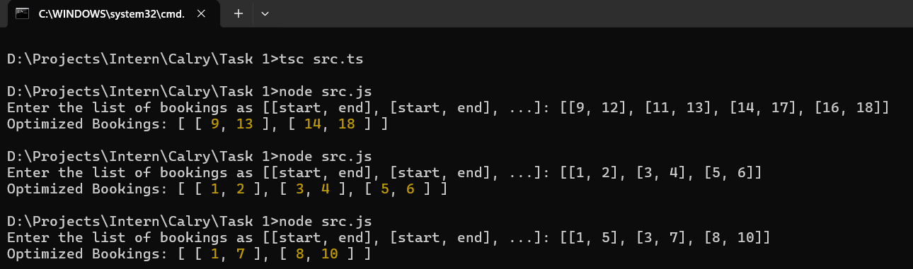

# Task 1: Meeting Scheduler - Optimize Bookings

This project provides a function to optimize meeting room bookings by merging overlapping or consecutive meeting times. The function takes in an array of meeting times (as start and end times) and returns an optimized list of booking periods. The input and output are arrays of pairs of numbers representing start and end times.

The solution ensures that meeting room bookings are optimized without overlaps or redundant consecutive bookings, making it useful in workplace management applications.

## Table of Contents
- [Objective](#objective)
- [How It Works](#how-it-works)
- [Setup and Installation](#setup-and-installation)
- [Usage](#usage)
  - [Running the Script](#running-the-script)
  - [Input Format](#input-format)
  - [Example Input/Output](#example-input-output)
- [Test Cases](#test-cases)

## Objective
The goal of this project is to develop a function that merges overlapping or consecutive meeting times, ensuring that the list of bookings is optimized and free from redundancy.

## How It Works

The `optimizeBookings()` function takes in an array of arrays (each sub-array represents a meeting with a start time and an end time), and it outputs an optimized list of meeting times. It handles:
1. **Overlapping meetings** - Meetings that overlap will be merged into one.
2. **Consecutive meetings** - Meetings that end and start at the same time will be merged.

### Example
Given the input `[[9, 12], [11, 13], [14, 17], [16, 18]]`, the function merges:
- Meetings `[9, 12]` and `[11, 13]` into `[9, 13]`
- Meetings `[14, 17]` and `[16, 18]` into `[14, 18]`

The result will be `[[9, 13], [14, 18]]`.

## Setup and Installation

### Prerequisites

Before running the script, ensure that you have the following installed on your system:
1. **Node.js** (v18.x or later)
2. **TypeScript** (v5.x or later)

### Installation Steps

1. Install the required dependencies:
   
   ```bash
   npm install
   ```

   This will install the necessary TypeScript and Node.js type definitions.

2. If you haven't installed TypeScript globally, install it:
   
   ```bash
   npm install -g typescript
   ```

3. Compile the TypeScript file:
   
   ```bash
   tsc src.ts
   ```

   This will generate the compiled `src.js` file.

## Usage

### Running the Script

To run the script:

```bash
node src.js
```

When prompted, input the meeting times as an array of arrays in JSON format. Example input:

```
[[9, 12], [11, 13], [14, 17], [16, 18]]
```

### Input Format

- Input the meeting times in the form of a JSON array of arrays, where each sub-array represents a booking with two numbers `[start, end]`.
- The start and end times should be positive integers.

Example of valid input:
```
[[1, 3], [5, 6], [2, 4]]
```

Example of invalid input:
```
"[(1, 3), (5, 6)]"  // Wrong syntax, should be JSON format
```

### Example Input/Output

#### Input:
```
[[9, 12], [11, 13], [14, 17], [16, 18]]
```

#### Output:
```
Optimized Bookings: [[9, 13], [14, 18]]
```

#### Input:
```
[[1, 5], [5, 10], [12, 15]]
```

#### Output:
```
Optimized Bookings: [[1, 10], [12, 15]]
```

## Test Cases

Below are a few sample test cases to help you test the program.

1. **Non-overlapping Bookings**:
   - Input: `[[1, 2], [3, 4], [5, 6]]`
   - Output: `[[1, 2], [3, 4], [5, 6]]`
   
2. **Overlapping Bookings**:
   - Input: `[[1, 5], [3, 7], [8, 10]]`
   - Output: `[[1, 7], [8, 10]]`
   
3. **Consecutive Bookings**:
   - Input: `[[1, 5], [5, 8], [10, 12]]`
   - Output: `[[1, 8], [10, 12]]`

4. **Empty List**:
   - Input: `[]`
   - Output: `[]`

5. **One Booking**:k
   - Input: `[[1, 3]]`
   - Output: `[[1, 3]]`

## Image
